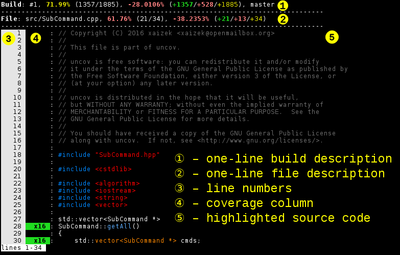
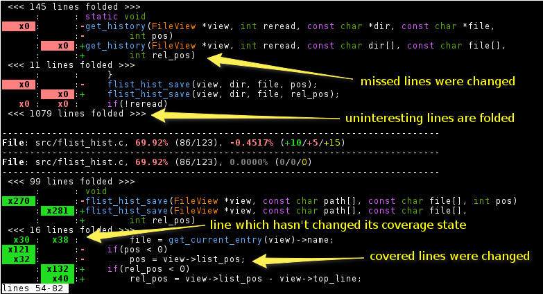

**uncov**, _v0.1_, _2016 – 2017_

_This file last updated on 10 February, 2017_

### Brief Description ###

`uncov` is a tool that collect and processes coverage reports.

By storing history of coverage reports it allows one to view how code coverage
changes over time, compare changes that happened and view current state of the
coverage.

The tool is deeply integrated with git repository of processed projects and thus
avoids generation of static reports.  Data is bound to repository information,
but can be freely shared by several copies of the same repository (builds
referring to unavailable git objects just won't be accessible).

Provided command-line interface should be familiar to most of git users and
helps to avoid switching to a browser to verify code coverage.

### Structure ###

Storage management tool itself is language independent and is relying on
complementary tools to fetch and transform coverage data from language specific
coverage harness.

Importer of coverage for C and C++ languages that collects data from `gcov` is
provided.

#### Adding support for a language ####

Support for other languages can be added by converting existing coverage tools
or even using them as is.  The `new-json` subcommand accepts JSON that's used by
[coveralls.io][coveralls] API, all what's needed is to extract this JSON and
pipe it to `uncov new-json` (some tools might already have a command-line option
like `--dump`, others could be extended by adding it).

### Features ###

* Code highlighting.
* Comparison of coverage.
* Displaying parts of files that need attention with regard to coverage.
* Can be used from Vim via the plugin provided.
* Can be used on CI to display coverage.

### Status ###

Overall structure and basic elements are expected to remain in place, however
they aren't finalized and changes for the sake of improvement are possible.
Databases will be migrated if schema changes, so previously collected data won't
be lost.

#### Main things missing ####

 * Configuration.  Currently values that could be configurable are hard-coded.
 * Tuning behaviour with command-line parameters.

### Supported Environment ###

Expected to work in Unix-like environments.

### Prerequisites ###

* [GNU Make][make].
* C++11 compatible compiler (GCC 4.9 works fine).
* [Boost][boost], tested with 1.55 and 1.59, but older versions might work.
* [libgit2][libgit2].
* [libsqlite3][sqlite].
* libsource-highlight from [GNU Source-highlight][srchilite].
* [zlib][zlib].
* [tntnet][tntnet].
* (optional) [pandoc][pandoc] for regenerating man page.
* (optional) [python][python] for collecting coverage for C and C++ (would be
  nice to get rid of this weird dependency, probably by rewriting the tool).

### Usage ###

`uncov-gcov` can be used to generate coverage, but it seems to not play well
with out-of-tree builds (some coverage is missing, this issue is inherited from
its origin), so the recommended way of recording coverage information is shown
in example below:

    # reset coverage counters from previous runs
    find . -name '*.gcda' -delete
    # < run tests here >
    # generage coverage for every object file found (change "." to build root)
    find . -name '*.o' -exec gcov -p {} +
    # generage and combine coverage reports (--capture-worktree automatically
    # makes stray commit if repository is dirty)
    uncov-gcov --root . --build-root . --no-gcov --capture-worktree \
               --exclude tests | uncov new
    # remove coverage reports
    find . -name '*.gcov' -delete

### Example ###

The easiest way of checking out `uncov` is by using it on itself (assuming that
you have just built it or just happen to have all the necessary development
dependencies).

In root of the project run `make self-coverage` and then do
`coverage/uncov build` to see something similar to:

`coverage/uncov dirs` shows coverage per directory:

`coverage/uncov changed` shows files which have their coverage changed:

`coverage/uncov show src/SubCommand.cpp` shows annotated `src/SubCommand.cpp`
file:

When most of a file is covered, one probably wants to see just what's not yet
covered, this can be done with `coverage/uncov missed` command:

### More Screenshots ###

Not everything can be demonstrated by self-coverage example above, so here are
some other interesting things.  List of latest builds (`uncov builds`):

Results of comparison (`uncov diff`):

### Credits ###

* [LCOV][lcov] project is the source of useful ideas and primary source of
  inspiration.
* [coveralls.io][coveralls] service is second project which significantly shaped
  this tool.
* Code of `uncov-gcov` is based on [cpp-coveralls][cpp-coveralls].
* [gcov-marker.vim][vim-gcov-marker] was the source of idea of filling location
  list with not covered lines in the plugin.

### License ###

GNU Affero General Public License, version 3 or later.

[lcov]: http://ltp.sourceforge.net/coverage/lcov.php
[coveralls]: https://coveralls.io/
[cpp-coveralls]: https://github.com/eddyxu/cpp-coveralls
[make]: https://www.gnu.org/software/make/
[boost]: http://www.boost.org/
[libgit2]: https://libgit2.github.com/
[sqlite]: https://www.sqlite.org/
[srchilite]: https://www.gnu.org/software/src-highlite/
[zlib]: http://zlib.net/
[tntnet]: http://www.tntnet.org/
[pandoc]: http://pandoc.org/
[python]: https://www.python.org/
[vim-gcov-marker]: https://github.com/m42e/vim-gcov-marker
